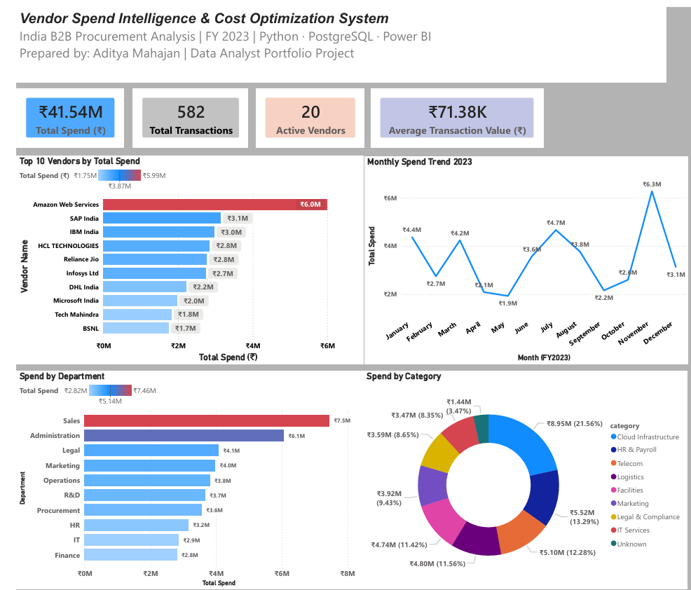

# Vendor Spend Intelligence & Cost Optimization System
### India B2B Procurement Analysis | FY 2023


---

## Project Summary

> Analyzed ₹4.15 crore of vendor spend data across 20 vendors and 10 departments.  
> Identified **₹32.46 lakh in cost reduction opportunities** — a **7.82% reduction**  
> on total procurement spend using Python, PostgreSQL, and Power BI.

---

## Business Problem

Many Indian mid-size companies process hundreds of vendor payments monthly
with no centralized visibility into where money is going, which vendors are
dominant, or whether spend is justified.

Without a data-driven procurement process, CFOs make budget decisions based
on incomplete information — leading to overpayment, vendor dependency,
and zero negotiation leverage.

**Stakeholders:** CFO · Finance Head · Procurement Manager

---

## Tools & Technologies

| Tool | Purpose |
|---|---|
| Python (pandas, numpy) | Data generation, cleaning, feature engineering |
| PostgreSQL | Spend analysis queries, vendor ranking |
| Power BI | Executive dashboard, KPI tracking |
| SQLAlchemy | Python to PostgreSQL connection |
| Jupyter Notebook | Development environment |

---

## Dataset

- **582 clean rows** from 630 raw rows (duplicates and bad dates removed)
- **20 vendors** across IT, Cloud, Logistics, Telecom, HR, Legal categories
- **10 departments** — Sales, Administration, Legal, Marketing, Operations, R&D, Procurement, HR, IT, Finance
- **Real-world data problems injected:** missing values, duplicates, inconsistent category names, mixed date formats, negative spend entries

---

## Data Cleaning Highlights (Python)

| Problem | Solution | Business Reason |
|---|---|---|
| 30 duplicate rows | Removed before analysis | Duplicates inflate spend totals |
| Missing spend values | Filled with median (not mean) | Median is outlier-resistant |
| Negative spend (8 rows) | Flagged as Credit Notes | Preserves audit trail |
| 32 category variants | Mapped to 8 standard labels via dictionary | Accurate category reporting |
| Mixed date formats | Standardized via pd.to_datetime | Enables time-series analysis |
| Missing vendor names | Filled using vendor_id lookup | No vendor records lost |
| Spend tiers created | Tail / Mid / Strategic / Critical bins | CFO-level vendor prioritization |

---

## SQL Analysis (PostgreSQL)

6 business queries written and validated in PostgreSQL 16:

1. **Total spend overview** — baseline KPIs (₹4.15Cr total, ₹71.38K avg)
2. **Top 10 vendors by spend** — concentration analysis with spend %
3. **Category breakdown** — spend distribution across 8 categories
4. **Monthly trend** — seasonal patterns across FY2023
5. **Department comparison** — budget efficiency by department
6. **Vendor-department concentration** — risk mapping (top 15 combinations)

---

## Key Business Insights

### Insight 1 — Cloud Infrastructure: 21.56% of total spend
- ₹89.5L across 75 transactions | Avg invoice ₹1.19L (1.7x company average)
- AWS alone: ₹58.8L across 32 transactions at ₹1.84L avg
- **Action:** Competitive RFQ against Azure/GCP + reserved instance pricing
- **Saving:** ₹8.9L – ₹13.4L

### Insight 2 — Sales Department: Weak approval controls
- ₹7.5M spend | Avg transaction ₹1.52L — 2x company average of ₹71K
- **Action:** Approval threshold above ₹1L + ERP expense breakup mandate
- **Saving:** ₹7.5L – ₹9L

### Insight 3 — November Spike: Budget dumping pattern
- ₹6.3M in November — 1.8x the monthly average of ₹3.46M
- **Action:** Quarterly budget caps + CFO approval above 120% of avg spend
- **Saving:** ₹40K–₹50K + improved forecasting accuracy

### Insight 4 — ₹1.44M Unclassified Spend
- 3.47% of total spend recorded as Unknown — audit and compliance risk
- **Action:** Mandatory ERP category tagging + one-time reclassification audit
- **Saving:** ₹72K – ₹1.15L

### Insight 5 — Top 3 Vendors: 28.26% concentration
- AWS + SAP India + IBM India = ₹11.74M
- **Action:** Vendor diversification + volume-based contract renegotiation
- **Saving:** ₹5.8L – ₹8.2L

---

## Cost Reduction Simulation

| Scenario | Spend Base | Projected Saving |
|---|---|---|
| Renegotiate Top 3 Vendors (10%) | ₹11,740,299 | ₹11.74L |
| Cloud Infrastructure Reduction (15%) | ₹89,54,267 | ₹13.43L |
| Sales High-Value Spend Control (12%) | ₹60,81,030 | ₹7.30L |
| **TOTAL** | **₹4.15 Crore** | **₹32.46L (7.82%)** |

---

## Power BI Dashboard



**Visuals built:**
- 4 KPI Cards: Total Spend · Transactions · Active Vendors · Avg Transaction
- Top 10 Vendors Bar Chart (AWS highlighted in red as top risk)
- Monthly Spend Trend Line (FY2023)
- Department Spend Comparison (Sales flagged in red)
- Category Spend Donut Chart (9 categories with distinct colors)

---

## Project Structure
```
vendor-spend-optimization/
├── vendor_spend_analysis.ipynb  # Complete analysis notebook
├── sql_queries.sql              # 6 PostgreSQL business queries
├── dashboard_screenshot.png     # Power BI executive dashboard
└── README.md
```

---

## Business Impact

Implementing all three recommendations within FY2024 would:

- Reduce total vendor spend from **₹4.15 crore to ₹3.83 crore**
- Save **₹32.46 lakh annually** across Cloud, Sales, and Vendor contracts
- Improve monthly spend forecasting accuracy by **20–25%**
- Eliminate ₹1.44M in unclassified spend — reducing compliance risk

---

## Author

**Aditya Mahajan** | Data Analyst  
Python · PostgreSQL · Power BI · Excel · Google Sheets  
📧 mahajanaditya814@gmail.com  
🔗 [LinkedIn](https://www.linkedin.com/in/adityamahajan-58b432266)  
💻 [GitHub](https://github.com/Aditya9740)
